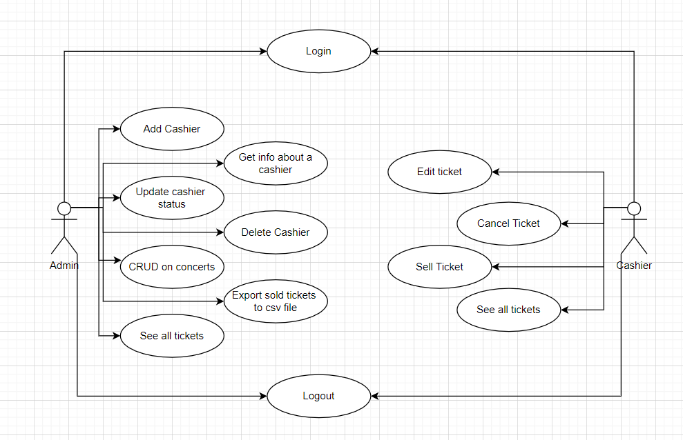

# Untold Festival - Ticket Selling System


Software Design - 1st Assignment - Ticket Selling System for Untold Festival

   Technical University of Cluj-Napoca\
   Computer Science\
  2021, Spring

## **Usage**

### Clone the repository

- **``
git clone https://github.com/blasio99/Untold-Festival.git
``**

### Configure the database connection

- Go to the **`untoldfestival\untold-server\src\main\resources`** folder
- Use the **`application.properties`** file as a template
- Create your own properties file with the name, for example, **`application-dev.properties`**
- At **`line 6`** personalize your database details
- At **`line 8 and 9`** set your **`username`** and **`password`** for the database

### Insert some personal data to the database

- Go to the **`untoldfestival\untold-server\src\main\resources`** folder
- In the **`import.sql`** file modify the entries with your own ones

___

## **Documentation**

### **Objective**

The objective of this assignment is to allow students to become familiar with layers architectural pattern, repository, services and unit tests.

### **Application Description**

Use JAVA/C# Desktop to design and implement a ticket selling system or the Untold festival.
The application should have two types of users (a cashier and an administrator) which must provide a username and a password to use the application.
The administrator user can perform the following operations:

- CRUD(Create, Retrieve, Update and Delete) on cashiers' information.
- CRUD on the performances at UNTOLD
- Administrators can export all the tickets that were sold for a certain show (.csv)

The cashier can perform the following operations:

- Sell tickets to a show
- The system should notify the cashier when the number of tickets per show was exceeded.
- A cashier can see all the tickets that were sold for a show, cancel a reservation, or edit it.

#### **Model UML use-case diagram**

 </img>

### **Approach**

- The system is based on the client-server architecture
- The system will be composed of the following components: a responsive web-client and a server
- The backend server will be implemented as a Java Spring application following an enterprise architecture comprising a data access layer, a service layer as well as an API layer. For data access a MySql database is used, while the API falls into the RESTful category. All of this is made possible by the Spring framework
- Similarly, the android application will be provided with its own local database, in order to allow the user to view his recorded data without internet connection. For this an ORMLite implementation is used, and for communication with the server the Retrofit API is used
- The web client utilizes simple html, css and JavaScript code (Using a template from bootstrapdash.com)

## **Design**

___

### **BACKEND**

There 4 types of layers:

- `Presentation Layer`
- `Model Layer`
- `Service Layer`
- `Repository Layer`

### **Model Layer**

Firstly we identify the entities representing the problem at hand, namely: `User` (admin or cashier), `Concert` and `Ticket`.

### **Repository Layer**

This layer is for manipulating the data in the database. In this case there is needed to create for each model class a Data Access Object which, in this project, will be interfaces extending Spring's CrudRepository generic interface.

As far as implementation goes, we simply extend the generic CrudRepository<M, ID> interface provided by Spring with the corresponding interfaces, that being `UserRepository<User, Long>`, `TicketRepository<Ticket, Long>` and `ConcertRepository<Concert, Long>` add any specific query
methods(if needed) and then the rest of the implementation is automatically generated upon the
start of the application.

**Mention**: The implementation of database access is handled automatically by Hibernate, embedded in the Spring Data JPA module.

### **Service Layer**

In this layer every model class gets a corresponding Service class which makes operations on the given model class based on what is needed and specified by the project description. 

```{build.gradle}
dependencies {
    Model Layer
    Repository Layer
}
```

### **Presentation Layer (API Layer)**

In most cases the Presentation Layer is the view part of a project, but since we have a frontend we just simplifying the data in JSON format which is sent to the **frontend**. 

**Mention**: we work with REST API

___

### **FRONTEND**

Near the template mentioned above/below, the types of files are:

- `.html` : for webpage elements
- `.css`  : for the webpage's layout/design
- `.js`   : for functionalities (where the API calls are handled as well)

The RestAPI calls are used to control the webpage. For instance the sign up page checks if the the one who wants to register is an existent user or not, validating the given values if they are correctly written, such as an e-mail, or even the 8 character password, the login page checks it as well, verifying the password too.

___

## **Contributing**

Contributions are what make the open source community such an amazing place to be learn, inspire, and create. Any contributions you make are **greatly appreciated**.  

- Fork the Project  
- Create your Feature Branch ( **`git checkout -b feature/AmazingFeature`** )
- Commit your Changes ( **`git commit -m 'Add some AmazingFeature'`** )
- Push to the Branch ( **`git push origin feature/AmazingFeature`** )
- Open a Pull Request  

## **Contact**

- Benedek Balázs - [LinkedIn Profile](https://www.linkedin.com/in/balazs-benedek-009322183/)
- E-mail: benedekbalazs1999@gmail.com
- Project Link: [GitHub - Untold Festival](https://github.com/blasio99/Untold-Festival)

___

## **References**

Template - Powered by bootstrapdash.com

Software Design Course @TUCN

[REST Controllers in Java using Spring](https://www.baeldung.com/category/rest/)

[Spring Data JPA](https://www.baeldung.com/the-persistence-layer-with-spring-data-jpa)

[Dependency Injection in Spring](https://www.baeldung.com/inversion-control-and-dependency-injection-in-spring)
